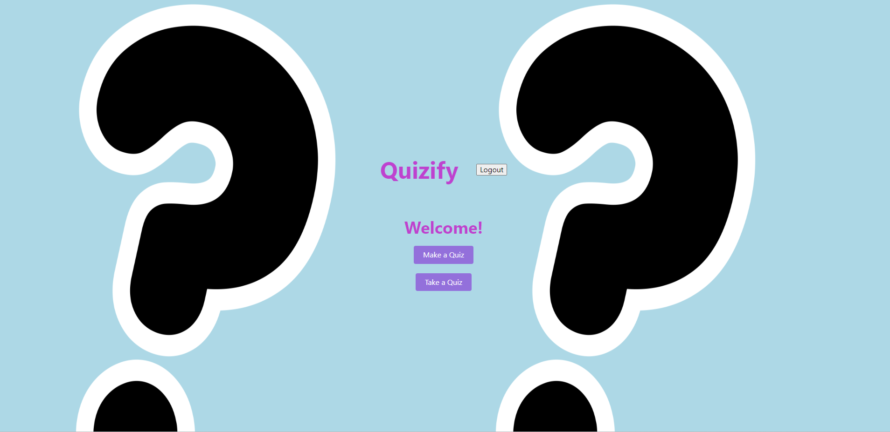

# Quizify

## General Information

Quizify enables users to login to our page, make any number of quizes on any topic of their choosing, and take quizes that others made.

## Technologies Used

- Node.js
- Express.js
- RESTful API.
- Handlebars.js
- Nodemon.js
- MySQL2 and the Sequelize ORM for the database.
- GET route
- POST route

## Link

(Close to the end of the project)

## Screenshot

## Table of Contents:

- [Information](#information)
- [Installation](#installation)
- [Usage](#usage)
- [Quizes](#quizes)
- [Contributing](#contributing)
- [Scores](scores)
- [Questions](#questions)
- [License](#license)

## Information

First, you need to sign up on Quizify by creating a username and password.
After you have successfully logged in, then you can choose whether you want to take a quiz or make a quiz. If you decide to take a quiz, then do your best to try to make 100%! If not, try again.  On the other hand, if you want to make a quiz, you can challenge yourself to come up with questions that may stump your peers. Good Luck!

## Installation

Download from the link above

## Usage

For those who failed to get on Jeopardy!

## Quizes

Unlimited for taking quizes or creating quizes

## Contributing
- [Tristan Melillo](https://github.com/TristanM225)
- [Jed Smith](https://github.com/solosolaire)
- [Gene Suhir](https://github.com/GSuhir)
- [Tod Winchester](https://github.com/Chesster14)

## Scores

Try to continuously beat your highest score. Once you have hit 100% then try to match that on a different quiz.  See how many 100% scores you can get in a row.

## Questions

Reach out to the contributors or

(https://www.google.com/)

## License

This application is covered under the MIT Licence

